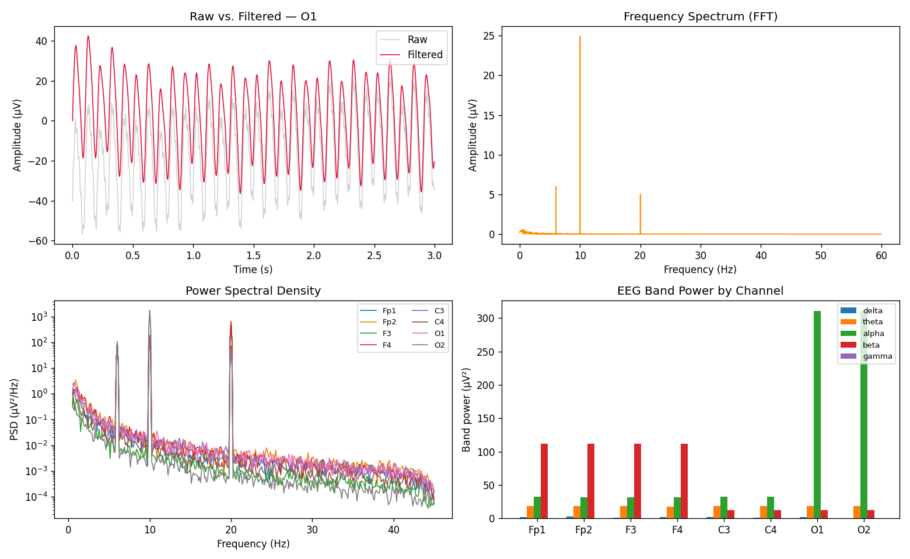

# 🧠 EEG Signal Explorer

Explore EEG recordings with filtering, visualization, and frequency
analysis using publicly available neuroscience datasets. A
beginner-friendly project demonstrating essential EEG signal
processing techniques for neuroscience and biomedical engineering
applications.



---
## 📌 Features

- 🧠 Load EEG recordings from open datasets
- 📈 Visualize raw EEG signals
- 🎚️ Apply band-pass and notch filtering
- 📊 Perform frequency spectrum (FFT) analysis
- 🌊 Display power spectral density (PSD)
- 📓 Interactive analysis using Jupyter Notebook

---
## 🛠️ Tech Stack

- **Python 3**
- **MNE-Python**
- **NumPy**
- **Matplotlib**

---
## 📂 Project Structure

```text
eeg-signal-explorer/
│
├── data/
│   ├── sample_eeg.edf
│   └── README.md
│
├── notebooks/
│   └── eeg_analysis.ipynb
│
├── src/
│   ├── loader.py
│   ├── preprocessing.py
│   ├── analysis.py
│   └── visualization.py
│
├── images/
│   └── sample_output.png
│
├── requirements.txt
├── LICENSE
└── README.md
```

---
## 📥 Installation

Clone the repository:

```bash
git clone https://github.com/yourusername/eeg-signal-explorer.git
cd eeg-signal-explorer
```

Install the required dependencies:

```bash
pip install -r requirements.txt
```

Launch Jupyter Notebook:

```bash
jupyter notebook
```

Open:

```text
notebooks/eeg_analysis.ipynb
```

---
## 🐍 Quick start (without Jupyter)

```python
from src import loader, preprocessing, analysis, visualization
import matplotlib.pyplot as plt

raw = loader.load_eeg("data/sample_eeg.edf")
loader.summarize(raw)

cleaned = preprocessing.preprocess(raw, l_freq=1.0, h_freq=40.0, notch_freq=60.0)

visualization.plot_filtered_comparison(raw, cleaned, channel="O1", duration=3.0)
plt.show()

freqs, psd, ch_names = analysis.compute_psd(cleaned)
visualization.plot_band_powers(freqs, psd, ch_names)
plt.show()
```

---
## 📊 Example Analyses

- Raw EEG waveform visualization
- Filtered EEG comparison
- Frequency spectrum (FFT)
- Power Spectral Density (PSD)
- Multi-channel EEG plotting
- EEG band power (delta/theta/alpha/beta/gamma) by channel

---
## 📚 Datasets

This project ships with a small synthetic EEG recording
(`data/sample_eeg.edf`) so it runs immediately with no downloads. It
also works with real, publicly available EEG datasets such as:

- **PhysioNet EEG** — https://physionet.org/
- **OpenNeuro** — https://openneuro.org/

You may also use your own EEG recordings in supported formats such as
EDF, BDF, or FIF. See `data/README.md` for details on the synthetic
sample data and on loading external datasets.

---
## 📖 Learning Objectives

This project helps you learn:

- EEG signal preprocessing
- Digital filtering techniques
- Frequency-domain analysis
- Power spectral analysis
- Scientific visualization
- Biomedical signal processing with Python

---
## 🚀 Future Improvements

- [ ] Time-frequency (Wavelet) analysis
- [ ] Event-Related Potential (ERP) visualization
- [ ] Interactive Plotly dashboards
- [ ] Machine learning classification
- [ ] Brain connectivity analysis
- [ ] Streamlit web interface

---
## 📚 References

- PhysioNet: https://physionet.org/
- OpenNeuro: https://openneuro.org/
- MNE-Python Documentation: https://mne.tools/
- NumPy Documentation: https://numpy.org/
- Matplotlib Documentation: https://matplotlib.org/

---
## 📄 License

This project is licensed under the MIT License. See [LICENSE](LICENSE).

---
## ⭐ Acknowledgements

Special thanks to:

- PhysioNet
- OpenNeuro
- MNE-Python developers
- NumPy and Matplotlib communities

---
> A beginner-friendly project for learning EEG signal processing,
> visualization, and frequency analysis using open neuroscience
> datasets.
